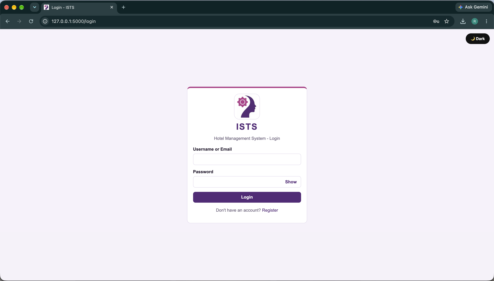
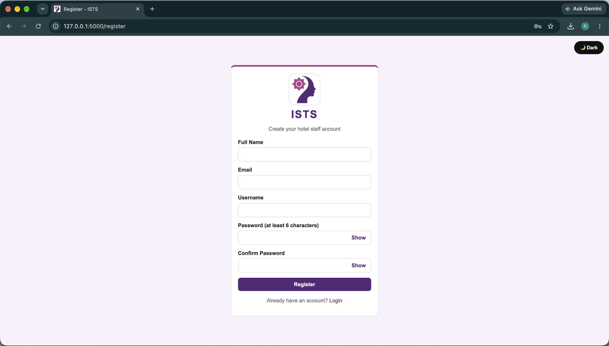
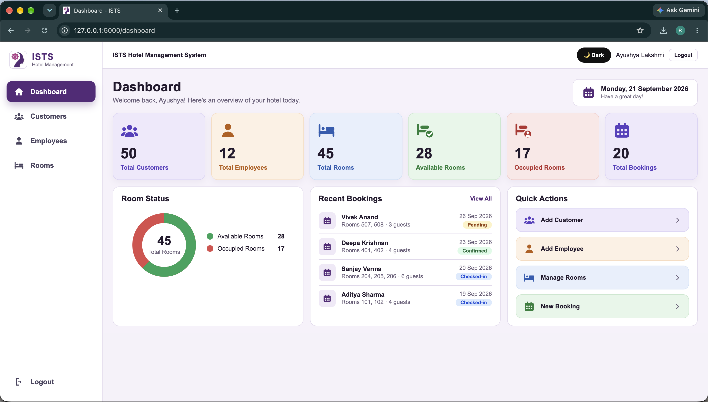
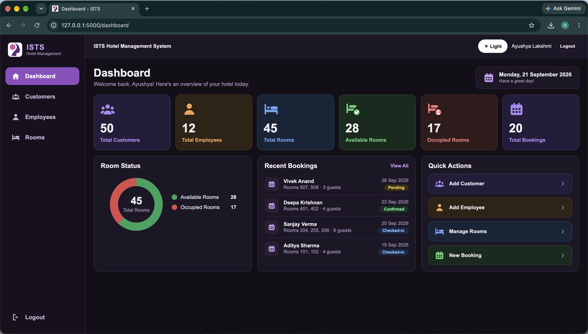
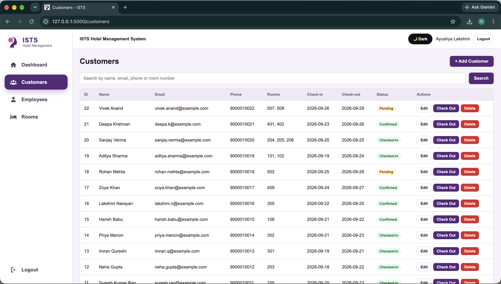
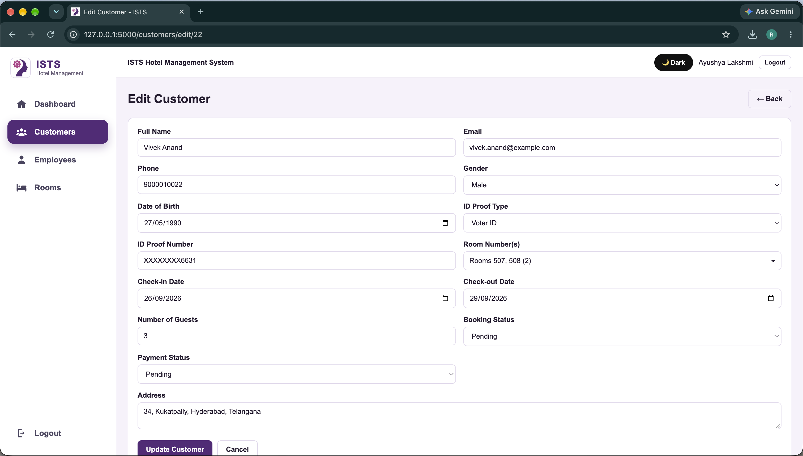
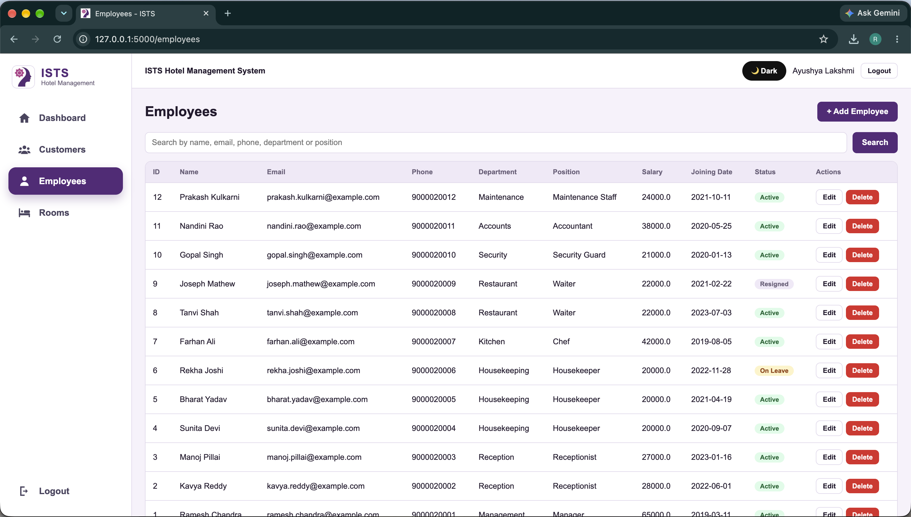
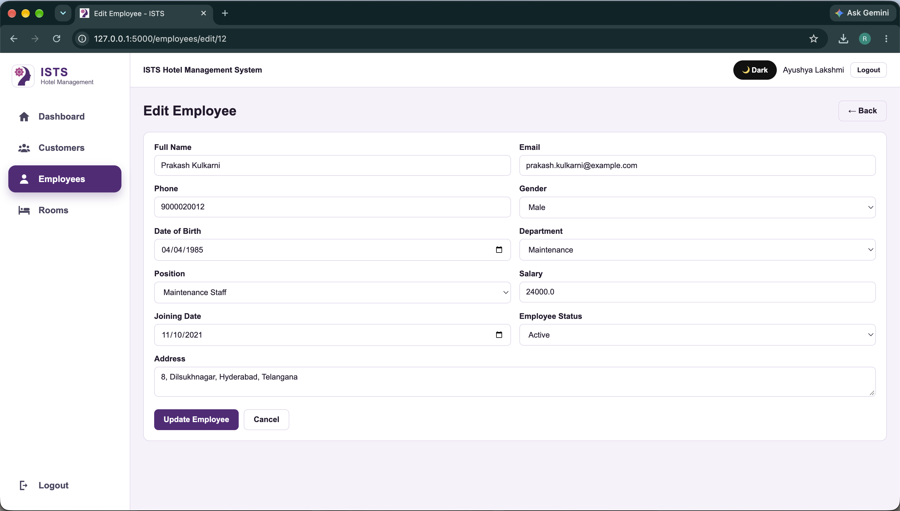
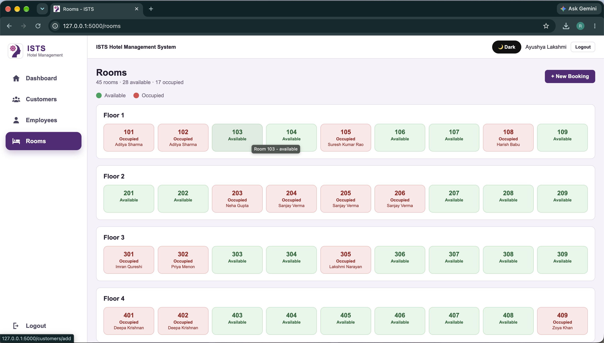

# ISTS Hotel Management System

A web-based **Hotel Management System** developed using **Python Flask, SQLite, HTML5, CSS3, JavaScript, and Jinja2 templates**.

The application provides a centralized interface for hotel staff to manage customers, bookings, rooms, employees, authentication, and room availability.

---

## Features

### Authentication
- Staff registration
- Staff login
- Password hashing
- Session-based authentication
- Logout functionality

### Dashboard
- Total customers
- Total employees
- Total rooms
- Available rooms
- Occupied rooms
- Total bookings
- Room status chart
- Recent bookings
- Quick actions

### Customer Management
- Add customers
- Edit customer records
- Search customers
- Delete customers
- Check out customers
- Manage booking and payment status
- Support multiple rooms for one customer

Customer information includes:
- Full name
- Email
- Phone
- Address
- Gender
- Date of birth
- ID proof type
- ID proof number
- Room number(s)
- Check-in date
- Check-out date
- Number of guests
- Booking status
- Payment status

### Employee Management
- Add employees
- Edit employee records
- Search employees
- Delete employees
- Manage employee status

Employee information includes:
- Full name
- Email
- Phone
- Address
- Gender
- Date of birth
- Department
- Position
- Salary
- Joining date
- Employee status

### Room Management
- View rooms floor by floor
- Display available and occupied rooms
- Support 45 rooms across 5 floors
- Prevent occupied rooms from being selected for new bookings
- Release rooms after customer checkout

### Search
Customer search supports:
- Name
- Email
- Phone
- Room number

Employee search supports:
- Name
- Email
- Phone
- Department
- Position

### Theme
- Light mode
- Dark mode
- Theme preference stored in the browser

---

## Technologies Used

| Layer | Technology |
|---|---|
| Frontend | HTML5, CSS3, JavaScript |
| Backend | Python 3, Flask |
| Templates | Jinja2 |
| Database | SQLite |
| Security | Werkzeug password hashing |
| Session Management | Flask Sessions |

---

## Database

The application uses **SQLite** for persistent application data.

Main database tables include:

### `users`

- id
- full_name
- email
- username
- password_hash
- created_at

### `customers`

- id
- full_name
- email
- phone
- address
- gender
- date_of_birth
- id_proof_type
- id_proof_number
- check_in_date
- check_out_date
- room_number
- number_of_guests
- booking_status
- payment_status
- created_at

### `employees`

- id
- full_name
- email
- phone
- address
- gender
- date_of_birth
- department
- position
- salary
- joining_date
- employee_status
- created_at

---

## Project Structure

```text
ISTS_Hotel_Management_System/
│
├── app.py
├── requirements.txt
│
├── database/
│   └── database.py
│
├── templates/
│   ├── base.html
│   ├── login.html
│   ├── register.html
│   ├── dashboard.html
│   ├── rooms.html
│   ├── _room_picker.html
│   ├── customers.html
│   ├── add_customer.html
│   ├── edit_customer.html
│   ├── employees.html
│   ├── add_employee.html
│   └── edit_employee.html
│
├── static/
│   ├── css/
│   │   └── style.css
│   ├── js/
│   │   └── script.js
│   └── images/
│
└── screenshots/
    ├── login.png
    ├── register.png
    ├── dashboard-light.png
    ├── dashboard-dark.png
    ├── customers.png
    ├── customer-edit.png
    ├── employees.png
    ├── employee-edit.png
    └── rooms.png
```

---

## Installation and Setup

### 1. Create a Virtual Environment

#### Windows

```bash
python -m venv venv
venv\Scripts\activate
```

#### macOS / Linux

```bash
python3 -m venv venv
source venv/bin/activate
```

### 2. Install Dependencies

```bash
pip install -r requirements.txt
```

### 3. Run the Application

```bash
python app.py
```

The Flask development server will start. Open the following address in your browser:

```text
http://127.0.0.1:5000/
```

### 4. Create an Account

After opening the application:

1. Click **Register** on the login page.
2. Enter your full name, email, username, and password.
3. Click **Register**.
4. Return to the login page.
5. Log in using your registered credentials.

### 5. Start Using the System

After successful login, you will be redirected to the **Dashboard**.

From the dashboard, you can:

- View hotel statistics
- Manage customers
- Manage employees
- View room availability
- Create new bookings
- Check out customers
- Search customer and employee records
- Switch between Light and Dark mode

---

## Application Workflow

```text
Start
  │
  ▼
Register / Login
  │
  ▼
Dashboard
  │
  ├───────────────┐
  ▼               ▼
Customers       Employees
  │               │
  ├─ Add           ├─ Add
  ├─ Edit          ├─ Edit
  ├─ Search        ├─ Search
  ├─ Check Out     └─ Delete
  └─ Delete
  │
  ▼
Room Availability
  │
  ├─ Available
  └─ Occupied
  │
  ▼
Logout
```

---

## Room Booking Logic

The system is designed to prevent double booking.

A room is considered occupied when it is associated with an active customer booking.

When a customer checks out:

```text
Customer Checkout
       ↓
Booking Status Updated
       ↓
Associated Rooms Released
       ↓
Rooms Become Available
```

The hotel contains:

```text
5 Floors × 9 Rooms = 45 Rooms
```

Room status is displayed visually:

- **Green** = Available
- **Red** = Occupied

---

# Screenshots

## Login



## Registration



## Dashboard - Light Theme



## Dashboard - Dark Theme



## Customer Management



## Edit Customer



## Employee Management



## Edit Employee



## Room Management



---

## Security

The application uses:

- Password hashing with Werkzeug
- Session-based authentication
- Protected application pages
- Form validation

Passwords are stored as password hashes rather than plain-text passwords.

---

## Project Objectives

The main objectives of the project are:

1. Develop a web-based Hotel Management System.
2. Provide staff registration and login functionality.
3. Manage customer records and bookings.
4. Support multiple-room bookings.
5. Prevent double booking of rooms.
6. Manage employee records.
7. Display room availability.
8. Provide hotel statistics through a dashboard.
9. Implement CRUD operations using Flask and SQLite.
10. Provide a simple and user-friendly interface.

---

## Future Improvements

Possible future enhancements include:

- Online payment integration
- Email and SMS booking notifications
- Invoice generation
- Detailed reports and analytics
- Role-based access control
- Reservation history
- PDF and Excel export
- Automated database backup and restore
- REST API integration
- Improved mobile responsiveness

---

## Project Information

**Project Name:** ISTS Hotel Management System

**Institution:** ISTS Women's Engineering College, Rajanagaram

**Application Type:** Web-based Hotel Management System

**Backend:** Python Flask

**Database:** SQLite

**Frontend:** HTML5, CSS3, JavaScript

---

## GitHub Repository

[ISTS Hotel Management System](https://github.com/Ayushya-Lakshmi-Nagireddy/ISTS_Hotel_Management_System)

---

## License

This project is intended for academic and educational purposes.

If you reuse or modify this project, please provide appropriate attribution to the original project authors.

---

## Acknowledgement

This project demonstrates practical implementation of:

- Flask web application development
- HTML and CSS interface design
- JavaScript interactions
- SQLite database management
- CRUD operations
- Authentication and sessions
- Form validation
- Room availability management
